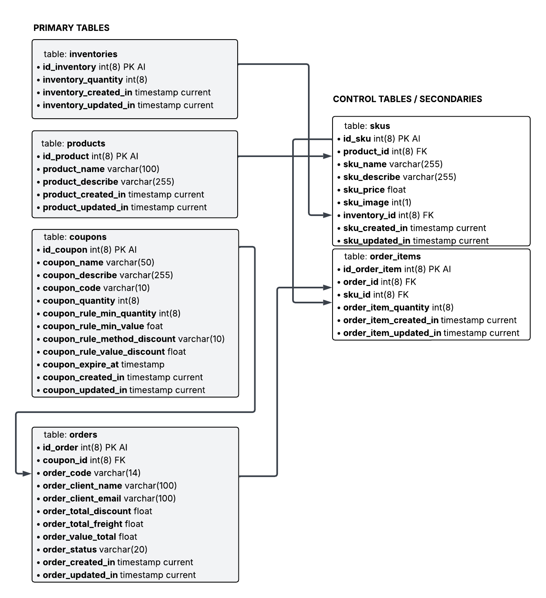

# 🧮 Montink Tiny ERP

[](https://www.php.net/releases/8_4_0.php)
[](https://getbootstrap.com/)
[](https://github.com/EricCamposDev)

Sistema ERP compacto desenvolvido com **PHP puro**, **Bootstrap 5.3** e **jQuery**. Ideal para pequenas operações com foco em **gestão de produtos, cupons,  pedidos e estoques**.

Os produtos são distribuidos através de suas variações(SKU), separado preço e saldo de estoque de cada item sku N -> 1 produto.

O projeto foi desenvolvido com o proposito de competir no processo seletivo da montink para uma oportunidade de desenvolvedor backend PHP.

---

## 🧬 Pré-requisitos

- PHP `>= 8.4`
- MySQL `>= 8`
- Composer instalado globalmente
- Navegador moderno
- Editor de código (VSCode recomendado)

---

## 🔗 Clone do projeto

```bash
git clone https://github.com/EricCamposDev/Montink_Tiny_ERP
cd Montink_Tiny_ERP
```

---

## ⚙️ Configurações

### 🔧 Arquivo de configuração da aplicação

Edite o arquivo `/app/config/config.php` com os seus dados de aplicação, servidor SMTP, conexão com o banco de dados MySQL e afins.

obs: **APP_KEY** é reservado para uma chave particular de cada projeto, ela pode conter qualquer valor e o quanto mais complexo for o valor mais seguro é o trafego de dados criptografados.

```php
    define("APP_NAME", "Montink Tiny ERP");
    define("APṔ_VERSION", "1.0");
    define("APP_ENV", "DEV"); // [DEV - PROD]
    define("APP_KEY", "XR9DtYZML9y2JKMeRmTj");
    define("APP_PATH_INDEX", 'http://'.@$_SERVER['SERVER_NAME'].':8000');

    define("DB_HOST", "");
    define("DB_NAME", "");
    define("DB_USER", "");
    define("DB_PASS", "");

    define("SMTP_HOST", "");
    define("SMTP_PORT", "");
    define("SMTP_USERNAME", "");
    define("SMTP_PASSWORD", "");

    define("APP_MAILER_NAME", "");
    define("APP_MAILER_ADDRESS", "");
```

---

## 📦 Instalação do banco de dados

O banco é instalado via composer CLI

```bash
composer install-db
```



Apos a instalação e configuração, o ERP está apto para uso.

O servidor pode ser iniciado.

```bash
php -S localhost:8000
```

## 📦 Tracking (Webhook de Rastreio de Pedidos)

Esta API permite atualizar o status de pedidos por meio de webhooks personalizados.

### 🔗 Rota

### [POST] /api/order/tracking


### 📥 Exemplo de body

```json
{
  "code": "20250728230700",
  "status": "PROCESSANDO"
}
```
### 🧾 Status disponíveis

    PENDENTE

    PROCESSANDO

    ENVIADO

    ENTREGUE

    CANCELADO = se cancelado o pedido é removido.

    DEVOLVIDO
